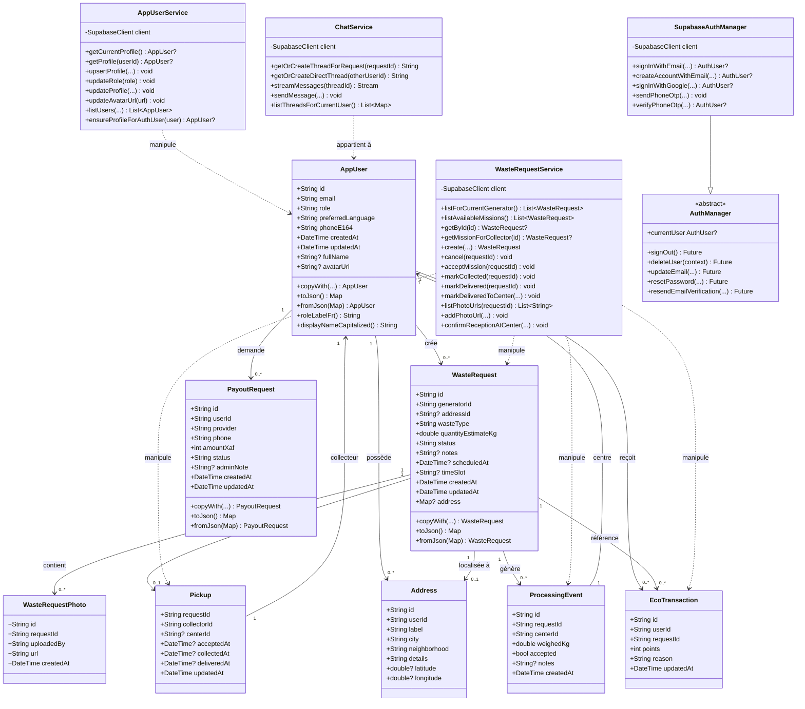
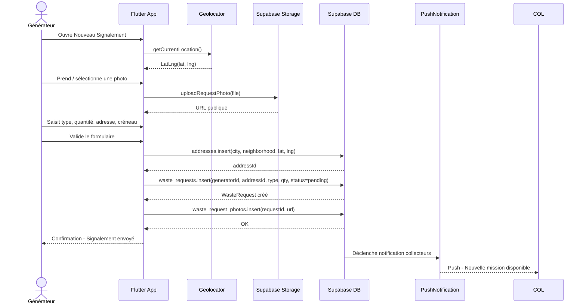
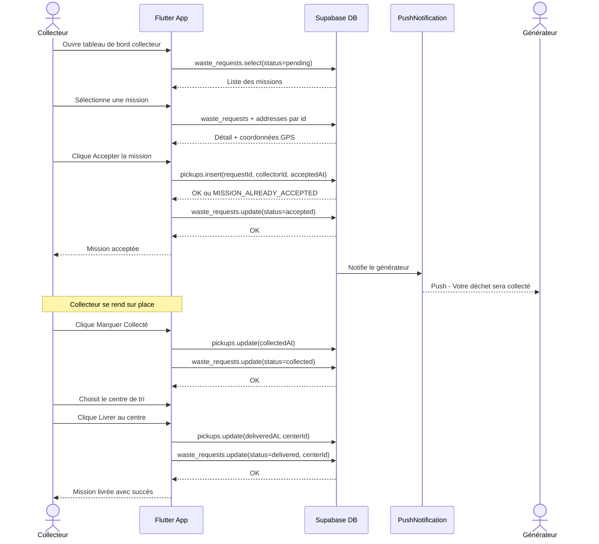
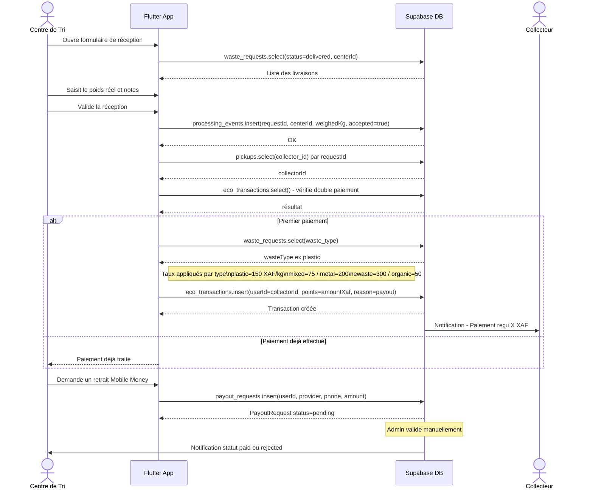
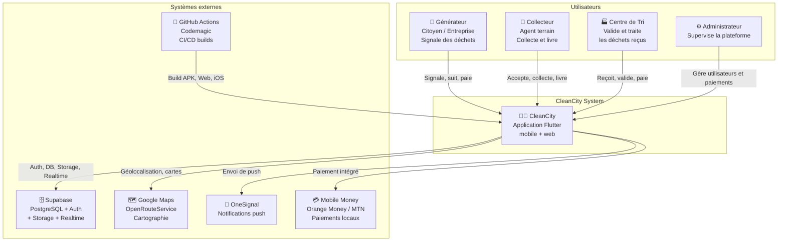
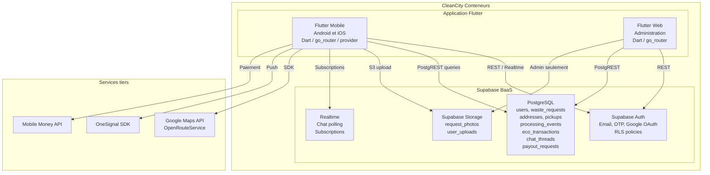
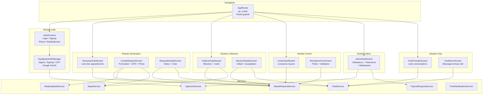
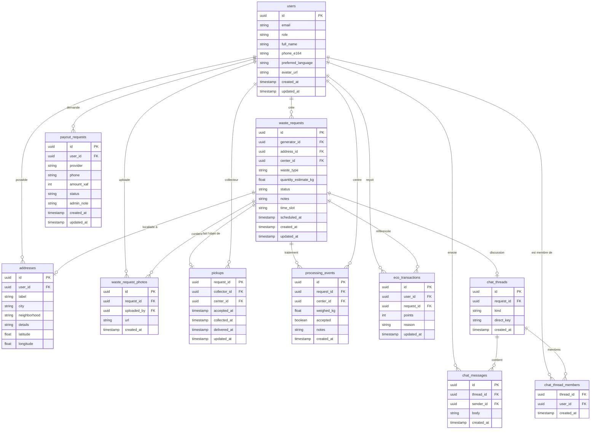

# 📐 Diagrammes UML & C4 — CleanCity

> Générés à partir du code source du projet (`lib/`, `models/`, `services/`, `auth/`, `nav.dart`).  
> Tous les diagrammes utilisent la syntaxe **Mermaid** (compatible GitHub, GitLab, Obsidian, VS Code).

---

## 1. Diagramme de Cas d'Utilisation

```mermaid
graph TD
    GEN((Générateur\nCitoyen))
    COL((Collecteur\nAgent))
    CTR((Centre\nde Tri))
    ADM((Administrateur))
    SYS((Système\nSupabase))

    subgraph "Authentification"
        UC_REG[S'inscrire\nemail / téléphone]
        UC_LOGIN[Se connecter\nemail / Google / OTP]
        UC_ROLE[Choisir son rôle]
        UC_PWD[Réinitialiser\nle mot de passe]
    end

    subgraph "Générateur — Signalements"
        UC_CREAT[Créer un signalement\nde déchets]
        UC_PHOTO[Joindre des photos]
        UC_GPS[Capturer la\nlocalisation GPS]
        UC_LIST[Consulter mes\nsignalements]
        UC_DETAIL[Voir le détail\nd'un signalement]
        UC_CANCEL[Annuler un\nsignalement]
        UC_PAY[Payer via\nMobile Money]
        UC_CHAT_G[Contacter le\ncollecteur]
    end

    subgraph "Collecteur — Missions"
        UC_MISSIONS[Voir les missions\ndisponibles]
        UC_MAP[Visualiser sur\nla carte]
        UC_ACCEPT[Accepter une mission]
        UC_COLLECT[Marquer Collecté]
        UC_DELIVER[Livrer au centre\nde tri]
        UC_CHAT_C[Contacter le\ngénérateur]
    end

    subgraph "Centre de Tri"
        UC_RECEP[Confirmer la\nréception]
        UC_WEIGH[Saisir le poids\nréel en kg]
        UC_PAYOUT[Déclencher le\npaiement collecteur]
        UC_PROC[Enregistrer un\névénement de traitement]
    end

    subgraph "Administration"
        UC_USERS[Gérer les\nutilisateurs]
        UC_REQS[Superviser\ntous les signalements]
        UC_PAYOUTS[Valider / Rejeter\nles demandes de paiement]
        UC_STATS[Consulter les\nstatistiques]
    end

    GEN --> UC_REG
    GEN --> UC_LOGIN
    GEN --> UC_ROLE
    GEN --> UC_PWD
    GEN --> UC_CREAT
    GEN --> UC_LIST
    GEN --> UC_DETAIL
    GEN --> UC_CANCEL
    GEN --> UC_PAY
    GEN --> UC_CHAT_G
    UC_CREAT --> UC_PHOTO
    UC_CREAT --> UC_GPS

    COL --> UC_LOGIN
    COL --> UC_MISSIONS
    COL --> UC_MAP
    COL --> UC_ACCEPT
    COL --> UC_COLLECT
    COL --> UC_DELIVER
    COL --> UC_CHAT_C

    CTR --> UC_LOGIN
    CTR --> UC_RECEP
    CTR --> UC_WEIGH
    CTR --> UC_PAYOUT
    CTR --> UC_PROC
    UC_RECEP --> UC_WEIGH
    UC_RECEP --> UC_PAYOUT
    UC_RECEP --> UC_PROC

    ADM --> UC_LOGIN
    ADM --> UC_USERS
    ADM --> UC_REQS
    ADM --> UC_PAYOUTS
    ADM --> UC_STATS

    SYS --> UC_REG
    SYS --> UC_GPS
    SYS --> UC_PAY
    SYS --> UC_PAYOUT
```

---

## 2. Diagramme de Classes

---

## 3. Diagrammes de Séquence

### 3.1 — Signalement d'un déchet (Générateur)

---

### 3.2 — Acceptation et collecte d'une mission (Collecteur)

---

### 3.3 — Réception au centre de tri et paiement (Centre)

---

## 4. Diagrammes C4

### 4.1 — C4 Niveau 1 : Contexte Système

---

### 4.2 — C4 Niveau 2 : Conteneurs

---

### 4.3 — C4 Niveau 3 : Composants (Application Flutter)

---

## 5. Diagramme Entité-Relation (Base de Données)

---

> **Visualisation :**  
> - **VS Code** : Extension *Markdown Preview Mermaid Support*  
> - **GitHub / GitLab** : Rendu natif dans les `.md`  
> - **En ligne** : [mermaid.live](https://mermaid.live)  
> - **Obsidian** : Plugin Mermaid intégré
